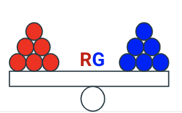
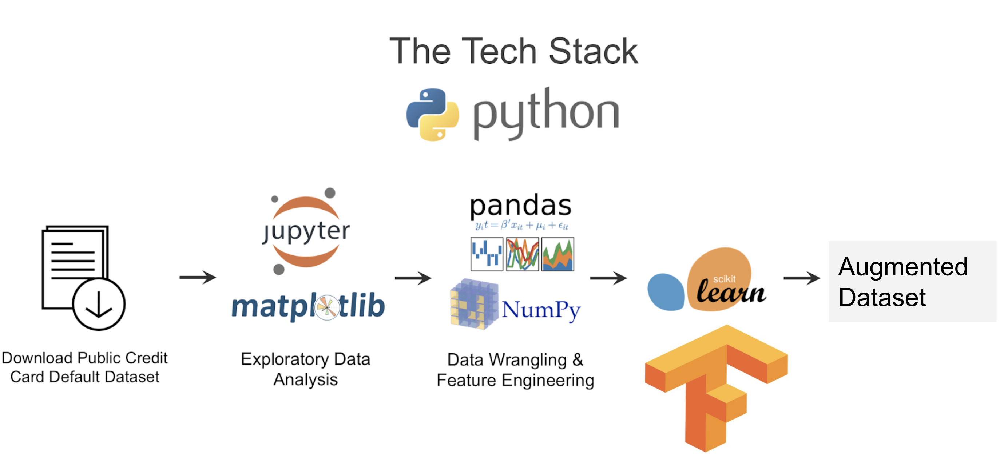

# RIVALGAN 


[Background](#background)  
[The Dataset](#the-dataset)  
[Implementation Overview](#implementation-overview) <br/>
[Usage](#usage)<br/>
[Visualizing the Data Augmentation Process](#visualizing-the-data-augmentation-process)<br/>
[GitHub Folder Structure](#github-folder-structure)<br/>
[Setup script](#setup-script)<br/>
[Requirements](#requirements)


------------

## Background
Imbalanced data sets for Machine Learning classification problems could be difficult to solve.
For example suppose we have two classes in our data set where  the majority class is more than 90% of the dataset 
and the minority is less than 1% but we are more interested in identifying instances of the minority class.
Most of the ML classifiers will reach an accuracy of 90% or more but this is not useful for our intended case.
A more properly calibrated method may achieve a lower accuracy, but would have a higher true positive rate (or recall).


A lot of critical real-data sets are imbalanced by nature like in credit card fraud detection or in the 
Health Care Industry due to the scarcity of data.  Traditional ways to fix imbalanced datasets is either 
by oversampling instances of the minority class or undersampling instances of the majority class (SMOTE).

Instead to tackle these issues, GANS are used to learn from the real dara and generate samples to augment 
the training dataset. A GAN is composed of a generator and a discriminator  (both are deep neural networks). 
The generator will try its best to make a sample by learning from a dataset  and the discriminator will learn 
to predict if a given sample is generated by the generator or if it is from  the original training dataset. 
This indication is then used by Generator in turn to generate data as close to the real data so as to fool
the discriminator.

------------

## The Dataset
The dataset contains 284,807 transactions that occurred in two days, where we have 492 frauds. 
The dataset is highly unbalanced, the positive class (frauds) account for 0.172% of all transactions.
Each of these observations corresponds to an individual transaction.
A binary response variable 'Class'  indicates whether or not this transaction is a fraud.
The dataset contains 30 features: 
* V1, V2, ... V28 which are anonymized features and uncorrelated after PCA transformations.
* 'Time' and 'Amount'which have not been transformed.

------------

## Process Overview and Tech Stack



------------

## Implementation Overview

This code trains a generative adversarial network to generate new synthetic data related to credit card fraud csv file. 
It can also read data from any other csv files but the file will need to be transformed so the class variable to predict is 
clearly identified. The code provides an api to visualize the synthetic data, compare the data distributions 
between the real and the augmented data. It also allows to train different classifiers (LogisticRegression, SVM, 
RandomForrest, XGBoost) and compare their performances with the real and augmented datasets. The synthetic data could
be generated using either SMOTE or GANs. Different GANs architectures are proposed (Vanilla GAN, 
Wasserstein GAN, Improved Wasserstein GAN, Least Squares GAN). Finally a random n-classes data set for classification
 problems is provided  and the decision boundaries are plotted on the real and augmented datasets.
 
 
 ------------
 
 
 ## Usage
 
 ``` bash


 $ python pipeline -h
 
 usage: pipeline.py [-h]
                   [--CLASSIFIER {Logit,LinearSVC,RandomForest,SGDClassifier,SVC}]
                   [--SAMPLER {SMOTE,SMOTETomek}]
                   [--AUGMENTED_DATA_SIZE AUGMENTED_DATA_SIZE]
                   [--TOTAL_TRAINING_STEPS TOTAL_TRAINING_STEPS]
                   [--GEN_FILENAME GEN_FILENAME]
                   [--train_classifier TRAIN_CLASSIFIER]
                   [--classifier_scores CLASSIFIER_SCORES]
                   [--generate_data GENERATE_DATA]
                   [--compute_learning_curves COMPUTE_LEARNING_CURVES]
                   [--aug_model_scores AUG_MODEL_SCORES]
                   [--plot_augmented_learning_curves PLOT_AUGMENTED_LEARNING_CURVES]
                   [--generate_distribution_plots GENERATE_DISTRIBUTION_PLOTS]
                   [--compare_scores COMPARE_SCORES]
                   [--random_dataset RANDOM_DATASET]
                   [--retrieve_real_data_generated_data RETRIEVE_REAL_DATA_GENERATED_DATA]

```
## API

RIVALGAN is available as a Python package.

```bash
 
$ pip3 install rivalgan

```

Examples

 ``` python

import rivalgan as rg

pipeline = rg.Pipeline()

data = pipeline.read_process_data()

pipeline.run_train_classifier()
    
pipeline.run_classifier_scores_report()

dargs = {
         'AUGMENTED_DATA_SIZE':5000, 
         'TOTAL_TRAINING_STEPS': 1000,
         'GAN_NAME':'VGAN'}
pipeline.set_configuration(dargs)
pipeline.run_train_gan()

pipeline.compare_classifier_gan_scores()

pipeline.generate_distribution_plots()

pipeline.plot_augmented_learning_curves()

```

------------

#### Output

```text

------------- Reading data --------------

Loading data from /home/ubuntu/insight/data/creditcard.engineered.pkl
Shape of the data=(284807, 31)
Head: 
        Time        V1        V2        V3        V4        V5        V6  \
0 -2.495776 -0.760474 -0.059825  1.778510  0.998741 -0.282036  0.366454   
1 -2.495776  0.645665  0.177226  0.108889  0.326641  0.047566 -0.064642   
2 -2.495729 -0.759673 -0.946238  1.240864  0.277228 -0.418463  1.425391   

         V7        V8        V9  ...         V21       V22       V23  \
0  0.234118  0.091669  0.343867  ...   -0.027953  0.392914 -0.259567   
1 -0.078505  0.077453 -0.237661  ...   -0.405091 -0.908272  0.228784   
2  0.775964  0.247431 -1.420257  ...    0.456138  1.094031  2.092428   

        V24       V25       V26       V27       V28    Amount  Class  
0  0.111992  0.253257 -0.396610  0.399584 -0.090140  1.130025      0  
1 -0.569582  0.329670  0.267951 -0.031113  0.069997 -1.138642      0  
2 -1.155079 -0.649083 -0.291089 -0.171222 -0.263354  1.695499      0  

[3 rows x 31 columns]
Number of frauds in training data: 379 out of 213605 cases (0.1774303036% fraud)
Number of frauds in test data: 113 out of 71202 cases (0.1587034072% fraud)
Number of features=30

------------- Training classifier --------------


Training 30 features with classifier SGDClassifier
Time elapsed to train:  0:00:00.34
Saving SGDClassifier in /home/ubuntu/insight/cache/SGDClassifier_Fraud.pkl
No sampler to train


------------- Baseline scores --------------

Baseline classifier SGDClassifier
Loading classifier SGDClassifier from file /home/ubuntu/insight/cache/SGDClassifier_Fraud.pkl
Predicting 30 features
Classification Report: 
                    pre       rec       spe        f1       geo       iba       sup

          0       1.00      0.96      0.91      0.98      0.93      0.88     71089
          1       0.03      0.91      0.96      0.06      0.93      0.87       113

avg / total       1.00      0.96      0.91      0.98      0.93      0.88     71202

Accuracy score: 0.9578523075194517
Precision score: 0.911504424778761
Recall score: 0.03329023917259211
F1 score: 0.06423448705955721
Confusion Matrix:  
 [[68098  2991]
 [   10   103]] 
 
------------- Training GAN and generating synthetic data  -------------- 
Training WGAN total_steps=1000, #generatedData=5000
Step: 0
Generator loss: 0.6404243111610413 | discriminator loss: 1.3558526039123535 

Step: 100
Generator loss: 0.3018853962421417 | discriminator loss: 1.5490034818649292 
 
```

------------

## Visualizing the Data Augmentation Process

<p align="left"></p>

<p align="center"></p>

<p align="center"></p>

<p align="center"></p>


------------

## GitHub Folder Structure

```text

.
|-- ./rivalgan                  <- Source code for use in this project.   
|-- ./reports                   <- Generated analysis as text files.
|-- ./generated_data            <- Generated data. 
|-- ./scripts                   <- Helper scripts to use the API.
|-- ./notebooks                 <- Jupyter notebooks.
|-- ./images                    <- Generated graphics and figures to be used in reporting.
`-- ./README.md                 <- The top-level README for this project.
                
```

------------

## Setup script
 A setup script is available to be used to generate RIVALGAN as a package.
 
 ------------
 ## Requirements
 See requirements.txt file